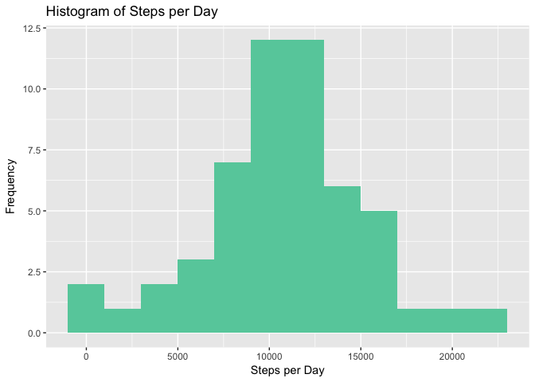
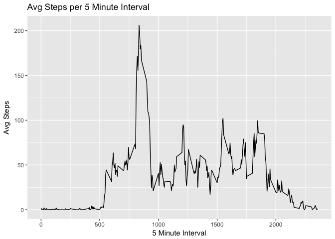
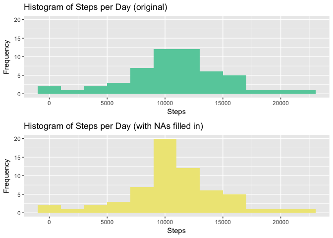
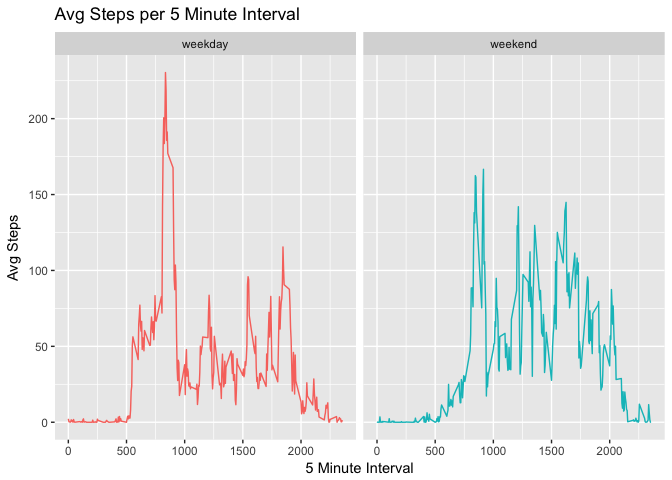

### 1) Loading and processing the data

Loadind packages and taking off scientific notation for charts later:


```r
library(dplyr)
library(ggplot2)
library(gridExtra)
library(xtable)
library(knitr)
options(scipen=999) # take off scientific notation
```

Downloading and importing data from the course website:


```r
unzip(zipfile="activity.zip")
activity <- as_tibble(read.csv("activity.csv", header=TRUE))
summary(activity)
```

```
##      steps                date          interval     
##  Min.   :  0.00   2012-10-01:  288   Min.   :   0.0  
##  1st Qu.:  0.00   2012-10-02:  288   1st Qu.: 588.8  
##  Median :  0.00   2012-10-03:  288   Median :1177.5  
##  Mean   : 37.38   2012-10-04:  288   Mean   :1177.5  
##  3rd Qu.: 12.00   2012-10-05:  288   3rd Qu.:1766.2  
##  Max.   :806.00   2012-10-06:  288   Max.   :2355.0  
##  NA's   :2304     (Other)   :15840
```

### 2) What is mean total number of steps taken per day?

Let's create a dataset with total steps by day called 'steps':


```r
steps <- activity %>%
  filter(!is.na(steps)) %>%
  mutate(date = as.Date(date))%>%
  select(steps, date) %>%
  group_by(date) %>%
  summarise(steps = sum(steps))

head(steps)
```

```
## # A tibble: 6 x 2
##         date steps
##       <date> <int>
## 1 2012-10-02   126
## 2 2012-10-03 11352
## 3 2012-10-04 12116
## 4 2012-10-05 13294
## 5 2012-10-06 15420
## 6 2012-10-07 11015
```

Exploring distribution of steps per day. Mean steps taken per day is: 10,766


```r
summary(steps$steps)
```

```
##    Min. 1st Qu.  Median    Mean 3rd Qu.    Max. 
##      41    8841   10765   10766   13294   21194
```

```r
ggplot(steps) +
  geom_histogram(aes(x = steps), binwidth = 2000, fill = "aquamarine3") + 
  labs (x = "Steps per Day", y = "Frequency", title = "Histogram of Steps per Day")
```

<!-- -->

### 3) What is the average daily activity pattern?

Here's a dataset called 'interval', summarising the average number of steps taken per 5 minute interval across all the days in the dataset:


```r
interval <- activity %>%
  group_by(interval) %>%
  summarise(avg_steps = mean(steps, na.rm = TRUE))
```

At interval 835, avg number of steps is 206 - the max in the dataset. Here we have a chart/time series of the the interval dataset:


```r
interval %>% filter (avg_steps == max(avg_steps))
```

```
## # A tibble: 1 x 2
##   interval avg_steps
##      <int>     <dbl>
## 1      835  206.1698
```

```r
ggplot(interval) +
  geom_line(aes(x = interval, y = avg_steps)) + 
  labs (x = "5 Minute Interval", y = "Avg Steps", title = "Avg Steps per 5 Minute Interval")
```

<!-- -->


### 4) Imputing missing values

Firstly, let's have a look at how much missing data we have. There are 2,304 rows/observations with missing steps data.


```r
sapply(activity, function(x) sum(is.na(x)))
```

```
##    steps     date interval 
##     2304        0        0
```

We are going to impute missing data for steps using the mean by interval over all days, and create a new dataset 'activity_v2' with missing data filled in:


```r
activity_v2 <- activity %>% 
  group_by(interval) %>% 
  mutate(steps = ifelse(is.na(steps), mean(steps, na.rm = TRUE), steps))
```

Now, let's re-create a previous datatset 'steps' (sum of steps by day), but with missing data filled - we'll call it 'steps_v2':


```r
steps_v2 <- activity_v2 %>%
  mutate(date = as.Date(date))%>%
  select(steps, date) %>%
  group_by(date) %>%
  summarise(steps = sum(steps))
```

```
## Adding missing grouping variables: `interval`
```

Comparing the original distribution of total number of steps taken each day with the new with imputed missing values, we can see that we now have more days with with 10,766 steps (the mean of original data) - this makes sense as this is the method of imputation we used. 
 

```r
grid.arrange(
  
  ggplot(steps) +
    geom_histogram(aes(x = steps), binwidth = 2000, fill = "aquamarine3") + 
    labs (x = "Steps", y = "Frequency", title = "Histogram of Steps per Day (original)") +
    ylim(0,20),
  
  ggplot(steps_v2) +
    geom_histogram(aes(x = steps), binwidth = 2000, fill = "khaki2") + 
    labs (x = "Steps", y = "Frequency", title = "Histogram of Steps per Day (with NAs filled in)")
  
)
```

<!-- -->

The distribution of the data has changed slightly:


```r
summary(steps$steps)
```

```
##    Min. 1st Qu.  Median    Mean 3rd Qu.    Max. 
##      41    8841   10765   10766   13294   21194
```

```r
summary(steps_v2$steps)
```

```
##    Min. 1st Qu.  Median    Mean 3rd Qu.    Max. 
##      41    9819   10766   10766   12811   21194
```

### 5) Are there differences in activity patterns between weekdays and weekends?

Firstly, let's create a new factor variable in the dataset with two levels: "weekday" and "weekend", indicating whether a given date is a weekday or weekend day.


```r
activity_v2 <- activity_v2 %>% 
  mutate(date = as.Date(date)) %>%
  mutate(day_type = ifelse(weekdays(date, abbreviate = FALSE) %in% 
                             c('Monday', 'Tuesday', 'Wednesday', 'Thursday', 'Friday'), 'weekday', 'weekend'))
```

Now we'll create a smaller dataset of avg steps by interval by day type (weekday/weekend) and create a plot to compare the two:


```r
weekdays <- activity_v2 %>%
  group_by(day_type, interval) %>%
  summarise(avg_steps = mean(steps, na.rm = TRUE))

head(weekdays)
```

```
## # A tibble: 6 x 3
## # Groups:   day_type [1]
##   day_type interval  avg_steps
##      <chr>    <int>      <dbl>
## 1  weekday        0 2.25115304
## 2  weekday        5 0.44528302
## 3  weekday       10 0.17316562
## 4  weekday       15 0.19790356
## 5  weekday       20 0.09895178
## 6  weekday       25 1.59035639
```

The data suggests that, on weekdays, there are more extreme peaks and troughs, with two more clear peaks of activity at the beginning and end of the day. The interval with max number of steps on weekdays is interval 835 with 230 avg steps, while on the weekend, it's interval 915 with 167 avg steaps. 

The weekday pattern is likely linked to work schedules, with second peak/max occuring at interval 1845 with 115 avg steps. Overall, data shows that, on avg, more steps are walked on the weekend (12,202) than on a weekday (10,256).


```r
ggplot(weekdays) +
  geom_line(aes(x = interval, y = avg_steps, group = day_type, colour = day_type)) + 
  labs (x = "5 Minute Interval", y = "Avg Steps", title = "Avg Steps per 5 Minute Interval") +
  facet_wrap (~ day_type) + 
  theme(legend.position="none")
```

<!-- -->

```r
weekdays %>%
  group_by(day_type) %>%
  summarise(total_avg_steps = sum(avg_steps))
```

```
## # A tibble: 2 x 2
##   day_type total_avg_steps
##      <chr>           <dbl>
## 1  weekday        10255.85
## 2  weekend        12201.52
```

